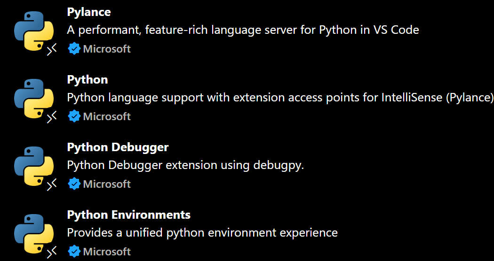
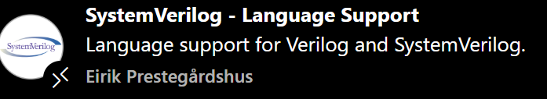

# HLS4ML Tutorial Guide

Before working throught the jupyter notebooks, run the startup script /home/Linux_setup.sh. Then run Conda init to fully startup Conda. To make sure it worked, run `conda activate hls4ml-env`. If succesfull, your shell should look like this

(with your username instead of mine)

Now install these extensions:

To use the environment, go into one of the jupyter notebooks and press the `select kernel` button in the top right

The kernel you want to select is hls4ml-env. Assuming the Python Environments extension is working, it should show up.
Once this is done, you should be good to go! Work through the hls4ml and let me know if you have any issues
